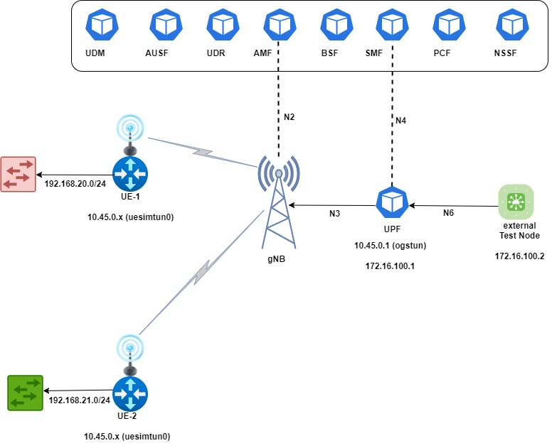

# 5G Core Framed Routing
Blog post: https://futuredon.medium.com/5g-frame-routing-6e34d8587123





**Create the Kubernetes cluster and the required CNI plugins**

```
wget https://github.com/kubernetes-sigs/kind/releases/download/v0.18.0/kind-linux-amd64

chmod +x kind-linux-amd64 && sudo mv kind-linux-amd64 /usr/local/bin/kind

kind create cluster -n core5g --config config-3node.yaml

curl -LO https://dl.k8s.io/release/v1.26.1/bin/linux/amd64/kubectl && chmod +x kubectl && sudo mv kubectl /usr/local/bin/

## Install Multus CNI

kubectl create -f https://github.com/k8snetworkplumbingwg/multus-cni/raw/release-3.7/images/multus-daemonset.yml

## Install koko that will be used to create the parent multus interfaces (needed in KIND cluster type)

curl -LO https://github.com/redhat-nfvpe/koko/releases/download/v0.82/koko_0.82_linux_amd64

chmod +x koko_0.82_linux_amd64 

sudo mv koko_0.82_linux_amd64 /usr/local/bin/koko

## Install CNI plugins likes macvlan, tuning etc

kubectl create -f https://github.com/infinitydon/5gcore-sctp-loadbalancer/raw/main/cni-install.yml
```

**Create the multus parent interfaces**

```
sudo koko -d core5g-worker,eth1 -d core5g-worker2,eth1

sudo koko -d core5g-worker,eth2 -d core5g-worker2,eth2
```

*ETH1* -- This will be used for the traffic between the UPF and external test node

*ETH2* -- This will be used for the UE internal traffic that the external test node will try to communicate with

```
kubectl get no
NAME                   STATUS   ROLES           AGE   VERSION
core5g-control-plane   Ready    control-plane   10h   v1.25.8
core5g-worker          Ready    <none>          10h   v1.25.8
core5g-worker2         Ready    <none>          10h   v1.25.8
```

**Install the Helm Charts**

```
helm -n core5g upgrade --install o5gs open5gs-helm-charts/ --create-namespace


Release "o5gs" does not exist. Installing it now.
NAME: o5gs
LAST DEPLOYED: Sun May  7 12:23:51 2023
NAMESPACE: core5g
STATUS: deployed
REVISION: 1
TEST SUITE: None
NOTES:
Status after deployment:

$(kubectl --namespace core5g get all)

kubectl -n core5g get po
NAME                                    READY   STATUS    RESTARTS   AGE
o5gs-amf-deployment-f8f695dd7-8rznc     1/1     Running   0          6m13s
o5gs-ausf-deployment-6fc65c47bc-ns2d9   1/1     Running   0          6m13s
o5gs-bsf-deployment-bb99c9fc-h7m6s      1/1     Running   0          6m13s
o5gs-ext-test-node-5dc8695554-m9sw8     1/1     Running   0          6m13s
o5gs-mongodb-75f77cf64b-2p6zm           1/1     Running   0          6m13s
o5gs-nrf-deployment-695d689bf5-zf4j5    1/1     Running   0          6m13s
o5gs-nssf-deployment-5c54c49c7b-9292k   1/1     Running   0          6m11s
o5gs-pcf-deployment-d8d87f44-znvxv      1/1     Running   0          6m13s
o5gs-scp-deployment-89d7fc6cc-j2msd     1/1     Running   0          6m12s
o5gs-smf-deployment-958cb4c47-m7q52     1/1     Running   0          6m12s
o5gs-udm-deployment-d56f6c696-66pwj     1/1     Running   0          6m12s
o5gs-udr-deployment-5b578f5f4d-6rcwb    1/1     Running   0          6m12s
o5gs-ue-import-74d75c6847-cz2h9         1/1     Running   0          6m13s
o5gs-ueransim-gnb-68f4d7cf87-nf6ql      1/1     Running   0          6m11s
o5gs-ueransim-ue-1-5f94898995-qr929     1/1     Running   0          6m11s
o5gs-ueransim-ue-2-5cc97878bd-qxh8h     1/1     Running   0          6m12s
o5gs-upf-deployment-5c9956c789-rjlpn    2/2     Running   0          6m13s
o5gs-webui-8d98648df-rvms7              1/1     Running   0          6m13s

```

**Ping UE1 internal IP from the external node:**

```
root@o5gs-ext-test-node-5dc8695554-m9sw8:/# ping 192.168.20.100 -c4
PING 192.168.20.100 (192.168.20.100): 56 data bytes
64 bytes from 192.168.20.100: icmp_seq=0 ttl=63 time=0.781 ms
64 bytes from 192.168.20.100: icmp_seq=1 ttl=63 time=0.687 ms
64 bytes from 192.168.20.100: icmp_seq=2 ttl=63 time=0.635 ms
64 bytes from 192.168.20.100: icmp_seq=3 ttl=63 time=0.672 ms
--- 192.168.20.100 ping statistics ---
4 packets transmitted, 4 packets received, 0% packet loss
round-trip min/avg/max/stddev = 0.635/0.694/0.781/0.054 ms
```

**Ping UE2 internal IP from the external node:**

```
root@o5gs-ext-test-node-5dc8695554-m9sw8:/# ping 192.168.21.100 -c4
PING 192.168.21.100 (192.168.21.100): 56 data bytes
64 bytes from 192.168.21.100: icmp_seq=0 ttl=63 time=0.712 ms
64 bytes from 192.168.21.100: icmp_seq=1 ttl=63 time=0.636 ms
64 bytes from 192.168.21.100: icmp_seq=2 ttl=63 time=0.681 ms
64 bytes from 192.168.21.100: icmp_seq=3 ttl=63 time=0.644 ms
--- 192.168.21.100 ping statistics ---
4 packets transmitted, 4 packets received, 0% packet loss
round-trip min/avg/max/stddev = 0.636/0.668/0.712/0.030 ms
```

